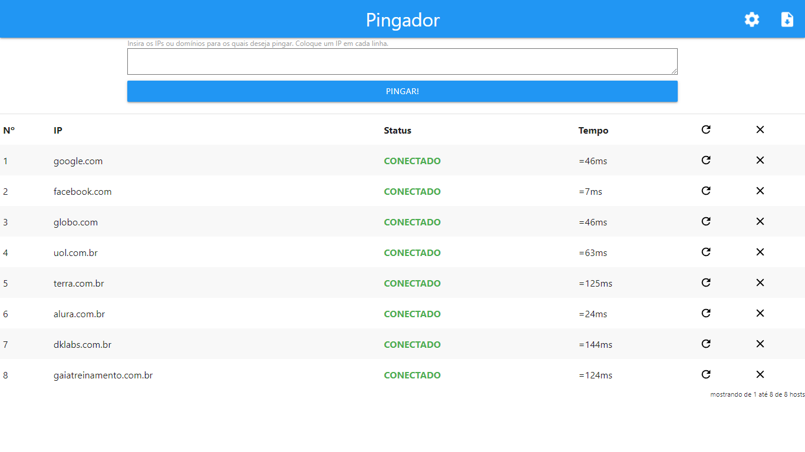

# Pingador

Um simples utilitário ICMP. Você insere uma lista de IPs ou domínios e a ferramenta envia pacotes ICMP (pings) para cada um deles, indicando o estado e a latência de cada host.

> Você pode usar o **Pingador** com IPs ou domínios.

## Como funciona?
1. Você insere uma lista de IPs, domínios ou rede e clica no botão *PINGAR!*
2. Os IPs/domínios digitados aparecerão em uma tabela logo abaixo.
3. Um ping será feito para cada IP/domínio digitado.
4. O estado e a latência de cada host aparecerá no respectivo campo das colunas *status* e *tempo*.
5. Você pode limpar todas as linhas da tabela ou apenas uma que não interesse mais.
6. Você pode refazer o ping para todos os hosts da tabela ou para apenas um que você deseje atualizar.
7. Um relatório em formato *.txt* ou *.xlsx* poderá ser baixado para o seu computador contendo a lista de IPs/domínios que você inseriu e os respectivos *status*.

Entradas permitidas:

| Tipo          |      Exemplo         |                      Descrição                           |
|---------------|----------------------|----------------------------------------------------------|
| IPv4          |  162.241.203.251     | O IP especificado será incluido na tabela de hosts       |
| IPv6          | 2001:4860:4860::8888 | O IP especificado será incluido na tabela de hosts       |
| IPv4 com CIDR | 192.168.1.0/24       | Todos os IPs da rede serão incluídos na tabela de hosts  |
| Domínio       | google.com.br        | O domínio especificado será incluído na tabela de hosts  |

## Atenção!

- Verifique se a função *exec()* não encontra-se desabilitada no arquivo *php.ini* do seu servidor. Essa função costuma estar desabilitada em servidores compartilhados por questões de segurança.

## Instalação
1. Clone o repositório:
~~~~
$ git clone git@github.com:itrio/pingador.git
~~~~
2. Navegue até a pasta de instalação e rode o composer:
~~~~
$ cd pingador
$ composer install
~~~~
3. Inicialize o seu servidor PHP e acesse o Pingador:
~~~~
http://localhost/pingador
~~~~

## Instalação com Docker
Esta aplicação também pode ser servida por um container docker.

1. Faça o build da imagem:
~~~~
$ docker build https://github.com/itrio/pingador.git -t itrio/pingador
~~~~
2. Crie um container a partir da imagem:
~~~~
$ docker run -d -p 80:80 --name pingador itrio/pingador
~~~~
3. Acesse através do navegador:
~~~~
http://localhost
~~~~

## Construído com

* [jQuery](https://maven.apache.org/) - Biblioteca Javascript
* [Materialize](https://github.com/Dogfalo/materialize) - Framework CSS baseado em Material Design
* [PhpSpreadsheet](https://github.com/PHPOffice/PhpSpreadsheet) - Biblioteca para leitura e escrita de arquivos
* [DataTables](https://github.com/DataTables/DataTables) - Biblioteca para gerenciamento de tabelas

## Autor

**Itrio Netuno** - 
[GitHub](https://github.com/itrio) -
[LinkedIn](https://www.linkedin.com/in/itrionetuno/)
